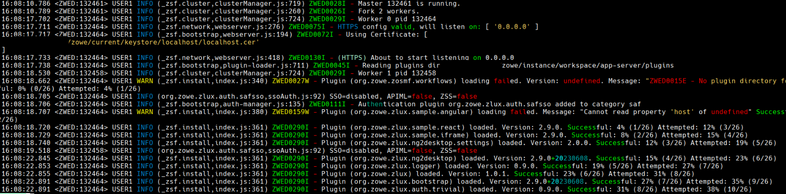
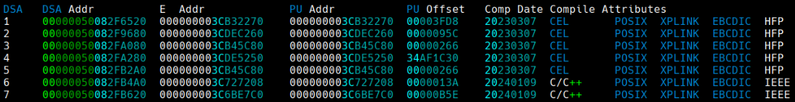
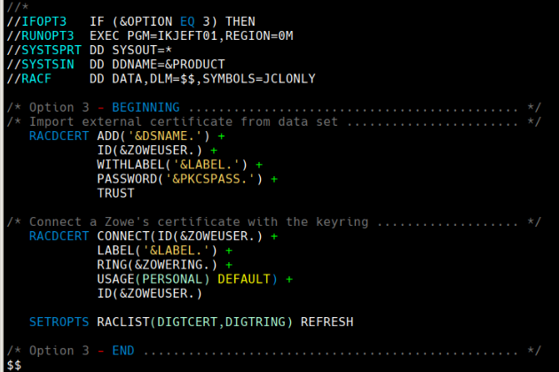
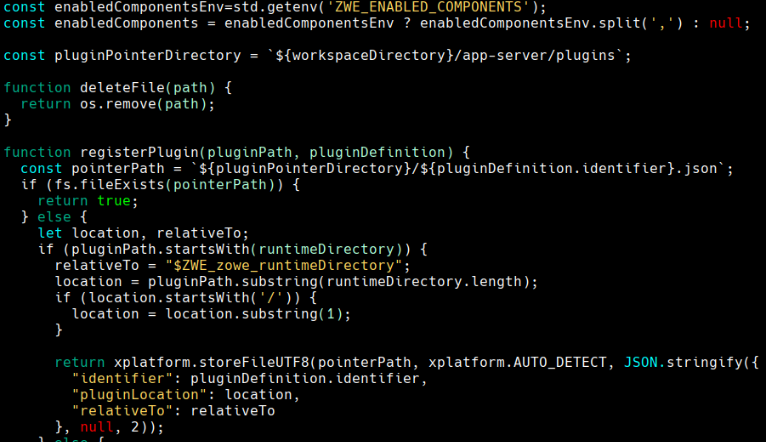
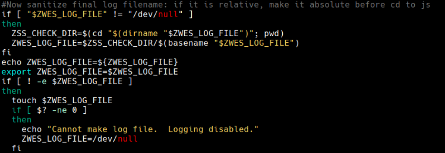

# chromaterm-rules
This repo is a collection of opinionated rules for https://github.com/hSaria/ChromaTerm

ChromaTerm is a neat project which can color your terminal output based on text seen and regex rules.

Each file contains a list of regex for different purposes.
Since the regex is all applied context-free, coloring subjects such as code becomes hard because you do not know which programming language is being viewed.
So, expect some compromise and edge cases within the rules you see.

So far I do not see a way to include multiple rule files into ChromaTerm. Instead, I recommend you find a collection of rules you like, and put them into one .chromaterm.yml file for use on your own machine.

# Examples

## Log files

## Dump files

## JCL

## JavaScript 

## Shell

# ChromaTerm setup recommendations
I recommend applying chromaterm on entire ssh or tmux sessions such as with `ct ssh ...` or `ct tmux` to get the full benefit. Then, everything you do in your terminal will be colored; `cat`, `man`, logs, `vi`, and so on.

For performance, I had success with running ChromaTerm both on python 3.11 and on pypy, and with the pcre2 library installed. I have not noticed any performance impact with this combination

## ChromaTerm limitations
In my experience, ChromaTerm cannot always hilight the things you are typing. I suspect this is because the regex rules are being applied at a time when only a few bytes are seen, so they do not match. However, if you scroll a buffer, or redraw the terminal, enough bytes are sent at once to get the rules to hit. Sometimes you get lucky though, and ChromaTerm really is able to hilight as you type.
